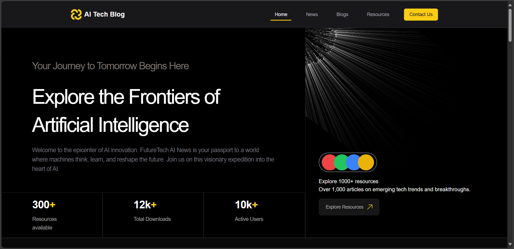
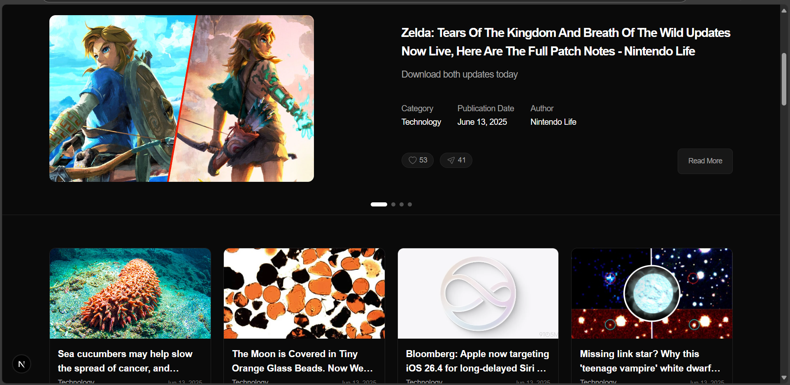

# 🧠 AiTechBlog

A modern, responsive, and feature-rich blog platform focused on AI, technology, and future trends. Built with cutting-edge web technologies to deliver a seamless user experience.

[](https://nextjs.org/)
[](https://www.mongodb.com/)
[](https://tailwindcss.com/)
[](https://opensource.org/licenses/MIT)

🌐 **Live Demo**: [ai-tech-blog-26p6.vercel.app](https://ai-tech-blog-26p6.vercel.app/)



## 🌟 Features

### Blog Management
- 📝 Rich text editor with Tiptap integration supporting:
  - Bold, italic, and highlighting
  - Custom hyperlink styles
  - Paragraphs and formatting
- 📑 Draft system with scheduling support
- 🗂️ MongoDB integration for content storage
- 📊 SEO-friendly content structure

### News & Media Integration
- 📰 Automated news fetching and storage
- 🎥 YouTube video integration with caching
- 📰 RSS feed parsing and content aggregation
- 🚀 Rate limiting and error handling
- ⚡ Client-side caching for performance

### Technical Features
- 🔒 API rate limiting and error handling
- 💾 MongoDB with Mongoose models
- 🚀 Next.js 13 App Router architecture
- 🛡️ Security best practices
- 📱 Responsive design with TailwindCSS

## 🛠️ Tech Stack

- **Frontend**:
  - Next.js 13 (App Router)
  - React 18
  - TailwindCSS
  - Tiptap Editor

- **Backend**:
  - MongoDB & Mongoose
  - Node-cron for scheduling
  - Next.js API Routes

- **APIs & Integration**:
  - RSS Feed Parser
  - YouTube Data API
  - News API Integration
  - Custom API endpoints

- **Deployment & Infrastructure**:
  - Vercel
  - MongoDB Atlas

## 📸 Screenshots

### News Section


### YouTube Integration


## 🚀 Getting Started

1. **Clone the repository**
   ```bash
   git clone https://github.com/yourusername/AiTechBlog.git
   cd AiTechBlog
   ```

2. **Install dependencies**
   ```bash
   npm install
   ```

3. **Set up environment variables**
   Create a `.env.local` file with the following variables:
   ```env
   MONGODB_URI=your_mongodb_connection_string
   YOUTUBE_API_KEY=your_youtube_api_key
   NEWS_API_KEY=your_news_api_key
   NEWS_API_ENDPOINT=your_news_api_endpoint
   ```

4. **Run development server**
   ```bash
   npm run dev
   ```

5. **Build for production**
   ```bash
   npm run build
   npm start
   ```

## 📚 API Documentation

### Blog Endpoints
- `GET /api/blogs` - Fetch all blogs with pagination
- `POST /api/blogs` - Create a new blog post
- `GET /api/blogs/:id` - Get a specific blog post

### News Endpoints
- `GET /api/news` - Fetch news articles with pagination
- `GET /api/scheduled-news` - Trigger scheduled news fetch


## 🏗️ Project Structure

```
AiTechBlog/
├── src/
│   ├── app/              # Next.js app router pages
│   ├── components/       # Reusable components
│   │   ├── blog/        # Blog-related components
│   │   ├── editor/      # Rich text editor
│   │   ├── news/        # News section components
│   │   └── ...
│   ├── lib/             # Database connection
│   ├── models/          # MongoDB models
│   └── utils/           # Helper functions
├── public/              # Static assets
└── ...config files
```

## 🧩 Key Components

- **RichTextEditor**: Tiptap-based editor with custom styling
- **NewsSection**: Dynamic news feed with caching
- **VideoSection**: YouTube integration with rate limiting
- **BlogContent**: Rich blog post display
- **MainNavBar**: Responsive navigation

## 🤝 Contributing

1. Fork the repository
2. Create your feature branch (`git checkout -b feature/amazing-feature`)
3. Commit your changes following conventional commits:
   ```
   feat: Add new feature
   fix: Fix bug
   docs: Update documentation
   style: Format code
   refactor: Refactor code
   test: Add tests
   ```
4. Push to the branch (`git push origin feature/amazing-feature`)
5. Open a Pull Request with a detailed description

## 📄 License

This project is licensed under the MIT License - see the [LICENSE](LICENSE) file for details.

## 📬 Contact

For inquiries or collaboration:
- 🌐 Website: [Your Portfolio]
- 📧 Email: [Your Email]
- 💼 LinkedIn: [Your LinkedIn]
##
<p align="center">Built with ❤️ using <b>Next.js</b>, <b>React</b>, and <b>TailwindCSS</b></p>
